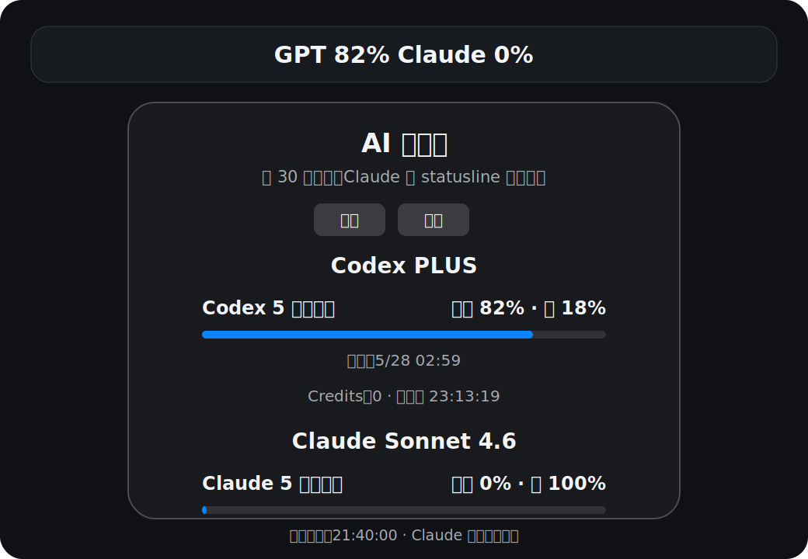
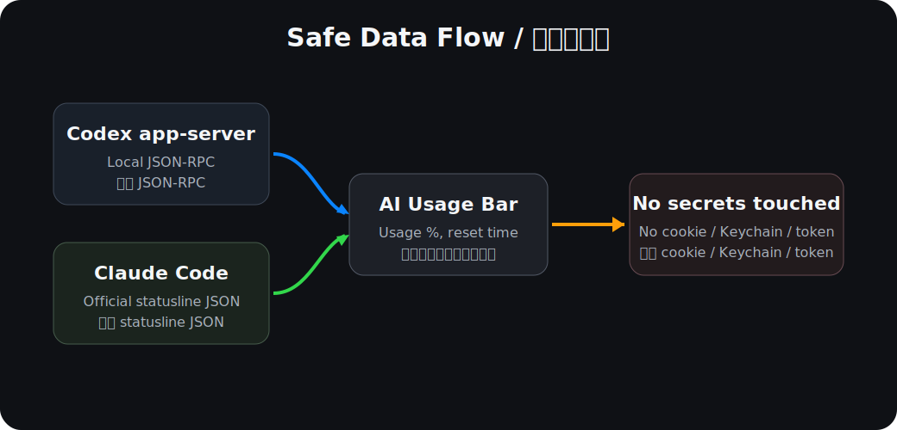

# AI Usage Bar for macOS



AI Usage Bar is a small macOS menu bar app that shows current usage for:

- Codex / ChatGPT account rate limits
- Claude account usage through Claude Code's official statusline data

It is built to be boring in the best way: no background daemon, no browser scraping, no cookie reading, no Keychain access, and no session token handling.

## Install

Compatibility:

- macOS 13 Ventura or newer
- Apple Silicon and Intel Macs; the app and Claude helper are built as universal binaries
- Codex desktop app is required for Codex / ChatGPT usage
- Claude Code is required for Claude usage updates

Download the installer package from this repository:

[installer/AIUsageBar-macOS-0.1.0.pkg](installer/AIUsageBar-macOS-0.1.0.pkg)

Future builds can also be attached to GitHub Releases.

The installer places the app in:

```text
/Applications/AI Usage Bar.app
```

Open the app once, then click the menu bar item.

> Note: this public package is currently ad-hoc signed. Without an Apple Developer ID and notarization, macOS may show an "unidentified developer" warning. The app source is included so the package can be audited and rebuilt locally.

For a smoother public release, sign and notarize the package with an Apple Developer ID certificate before distributing outside GitHub.

## First Run

Codex usage usually works automatically when the Codex desktop app is installed and logged in.

Claude requires one safe setup step:

1. Click **Install / Reinstall Claude statusline bridge** in the app.
2. If needed, click **Claude Code login**. This opens Claude Code's official login flow.
3. Send one message in Claude Code. Claude Code will then invoke the statusline bridge and usage appears in the menu bar.

After setup is complete, the setup controls disappear and the popover switches to the compact usage view.

## How It Works



### Codex / ChatGPT

The app starts the local Codex app-server from:

```text
/Applications/Codex.app/Contents/Resources/codex
```

Then it calls the local JSON-RPC method:

```text
account/rateLimits/read
```

Only usage percentages, reset times, plan information, and credit balance are displayed.

### Claude

Claude does not currently expose the same direct local usage endpoint. The safe supported path is Claude Code's statusline integration.

The app installs a native helper at:

```text
~/.claude/usage-bar/statusline-bridge
```

and writes this to Claude Code settings:

```json
{
  "statusLine": {
    "type": "command",
    "command": "~/.claude/usage-bar/statusline-bridge",
    "refreshInterval": 10
  }
}
```

When Claude Code receives account status data, it passes statusline JSON to the helper over stdin. The helper extracts only rate-limit percentages and reset timestamps, then writes:

```text
~/.claude/usage-bar/latest.json
```

The menu bar app reads that small cache file.

## Security Model

The project follows a strict no-secrets boundary.

It does not:

- read browser cookies
- read Claude Desktop / ChatGPT Desktop private storage
- read macOS Keychain items
- request Accessibility permission
- request Screen Recording permission
- request Full Disk Access
- collect prompts, responses, API keys, or session tokens
- send telemetry to any server

The only user files it writes are:

```text
~/.claude/settings.json
~/.claude/usage-bar/statusline-bridge
~/.claude/usage-bar/latest.json
```

If an existing Claude Code statusline is present, it is backed up to:

```text
~/.claude/usage-bar/previous-statusline.json
```

Read the full security notes in [SECURITY.md](SECURITY.md).

## Build From Source

Requirements:

- macOS 13 or newer
- Xcode Command Line Tools
- Codex desktop app installed for Codex usage
- Claude Code installed for Claude usage

The build script produces universal `arm64 + x86_64` binaries by default.

Build the app:

```bash
CodexUsageBar/build.sh
```

Build the installer package:

```bash
scripts/build-installer.sh
```

Run the security audit helper:

```bash
scripts/security-audit.sh
```

The installer package is written to:

```text
dist/AIUsageBar-macOS-0.1.0.pkg
```

## Repository Layout

```text
CodexUsageBar/
  Info.plist
  Sources/
    main.swift
    statusline_bridge.swift
  build.sh

scripts/
  build-installer.sh
  security-audit.sh

docs/
  usage-popover.svg
  security-flow.svg
```

## Limitations

- Claude usage updates only after Claude Code invokes the statusline command. If Claude Desktop or Claude Cowork is used without Claude Code activity, the app shows the latest statusline snapshot.
- The package is ad-hoc signed unless the maintainer builds it with a Developer ID certificate and notarizes it.
- Future Codex or Claude Code changes may require updates. The implementation avoids private storage so failures should be visible and recoverable rather than secret-dependent.

## License

MIT
